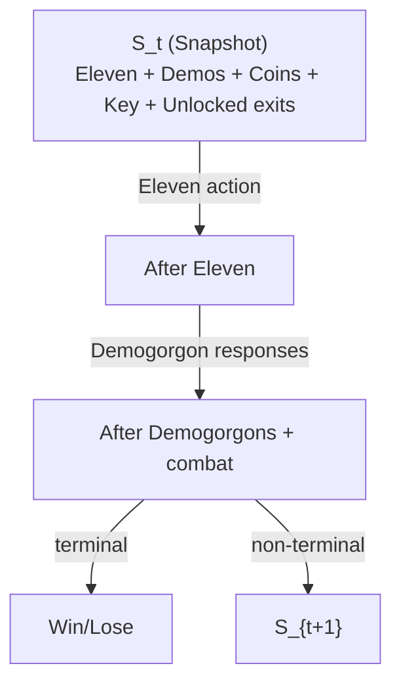

# 🎮 Upside Down: Tactical Escape

A real-time tactical AI game built using **Python** and **Pygame**, inspired by the *Stranger Things* universe.
Control Eleven as she attempts to escape a maze filled with Demogorgons using intelligent decision-making algorithms.

---

## 🚀 Features

* 🧠 **MCTS with UCT** for Eleven's movement (selection, expansion, rollout, backprop)
* 🤖 **Minimax + Alpha-Beta Pruning** for Demogorgon AI behavior
* 🧱 **12x12 random DFS maze generation** each run (rooms, corridors, loops)
* 🚪 One locked exit, **gold coin + key objective**, and fixed turn time limit
* 🌀 **Tunnel shortcuts** for fast escapes and interceptions
* ⚔️ **Directional combat** (backstab vs frontal encounters)
* 🌫️ **Detection radius visualization** for Demogorgons
* 🎨 Procedurally generated sprites and tiles (no external assets)
* 🔊 Procedural creepy **encounter ambient sound**
* 🕹️ Fully automated **AI vs AI** turn-based gameplay

---

## 🧠 AI System Overview

### 🔵 Eleven (Player AI)

* Uses **Monte Carlo Tree Search (MCTS)**
* Simulates multiple future states to choose safest path
* Prioritizes:

  * Distance from enemies
  * Shortest path to exit
  * Survival probability

---

### 🔴 Demogorgons (Enemy AI)

* Uses **Minimax Algorithm**
* Behavior:

  * **Chase mode** (when player detected)
  * **Patrol mode** (when player not detected)
* Objective:

  * Block Eleven’s path to exits
  * Minimize escape chances

---

## 🗺️ Game Mechanics

### 🎯 Objective

* Escape through one of the maze exits
  **OR**
* Defeat all Demogorgons

---

### ❤️ Health System

* Eleven's health = `(Number of Demogorgons × 3) - 1`
* Each Demogorgon has **3 lives**

---

### ⚔️ Combat Rules

* **Backstab (from behind):**

  * Damages Demogorgon
* **Frontal attack:**

  * Damages Eleven
* Includes knockback effects

---

### 👁️ Detection System

* Demogorgons detect Eleven within a certain radius
* Visual "scent" effect shows detection area

---

## 🌳 State Space Tree

This project’s AI can be understood as exploring a **state-space tree**: from a state $S_t$, Eleven chooses an action, Demogorgons respond, and the game either ends (win/lose) or transitions to $S_{t+1}$.

- Full document (state definition, actions, terminal conditions): **[STATE_SPACE_TREE.md](STATE_SPACE_TREE.md)**
- Slide-ready compact diagram: **[STATE_SPACE_TREE_SLIDE.md](STATE_SPACE_TREE_SLIDE.md)**

### 2-ply tree shape (one round)



## 🧱 Project Structure

The project is organized into modular components for maintainability and clarity:

```
upside-down-chase/
├── main.py              # Entry point - initializes game and runs main loop
├── game.py              # Core game logic, rendering, and game state management
├── entities.py          # Data structures (Direction, AgentState, Snapshot) and utilities
├── maze.py              # Procedural maze generation and A* pathfinding algorithms
├── ai/
│   ├── mcts.py          # Monte Carlo Tree Search implementation
│   ├── minimax.py       # Minimax with alpha-beta pruning
│   └── __init__.py
├── README.md            # This file
├── .gitignore           # Git ignore rules
├── .venv/               # Python virtual environment
└── .git/                # Version control
```

---

## 🛠️ Installation & Setup

### 1️⃣ Clone the repository

```bash
git clone https://github.com/TheWorthless11/upside-down-chase.git
cd upside-down-chase
```

---

### 2️⃣ Install dependencies

```bash
pip install pygame
```

---

### 3️⃣ Run the game

```bash
python main.py
```

---

## 🎮 Controls

| Key | Action                    |
| --- | ------------------------- |
| ESC | Quit game (anytime)       |
| R   | Restart (after game over) |
| Q   | Quit (after game over)    |

**Note:** ESC-Quit is displayed in the HUD bottom-left corner during gameplay for quick reference.

---

## ⚙️ Configuration

You can tweak gameplay via constants in the code:

* `GRID_SIZE` → Maze size
* `FPS` → Game speed
* `mcts_simulations` → AI strength/performance
* `detection_radius` → Enemy awareness

---

## 📈 Future Improvements

* 🎯 Difficulty levels (easy / medium / hard)
* 🧠 Improved MCTS optimization
* 🌐 Multiplayer / manual control mode
* 🎨 Enhanced UI and animations
* 📊 Performance optimization for large simulations
* 💾 Save/load game states

---

## 🧑‍💻 Author

**Mahhia**
CSE Undergraduate Student
**Shaila**
CSE Undergraduate Student
---

## 📜 License

This project is open-source and available under the **MIT License**.

---

## 🌟 Acknowledgements

* Inspired by *Stranger Things*
* Built with ❤️ using Python & Pygame

---

## ⭐ Support

If you like this project:

* Give it a ⭐ on GitHub
* Share it with others

---
